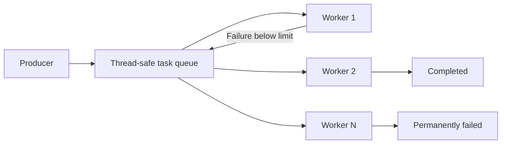

# Distributed Task Processing Simulation

A Python simulation of a fault-tolerant producer-consumer system. Producers place jobs on a thread-safe queue, configurable worker threads process them concurrently, and failed jobs are retried up to a defined limit.

This self-initiated project explores the core ideas behind asynchronous job processing systems: decoupled producers and consumers, worker concurrency, retry policies, failure handling, observability, and graceful shutdown.

## Architecture



The producer and workers run in separate threads. The queue safely coordinates access to tasks and allows producers and consumers to operate independently. A stop event signals shutdown; the system stops producing, finishes queued work, and joins its threads.

## Features

- Configurable number of worker threads
- Configurable duration, retry limit, failure rate, and production interval
- Automatic retry handling for transient failures
- Permanent-failure reporting when the retry limit is reached
- Structured, timestamped logging with thread names
- Graceful shutdown after queued work is completed
- Deterministic unit tests for success, retry, failure, and validation paths

## Technologies

- Python 3
- `threading` and `queue`
- `logging`
- `pytest`

## Run locally

```bash
git clone https://github.com/zandiledladla/distributed-system-simulation.git
cd distributed-system-simulation
python distributed_simulation.py
```

Example with custom settings:

```bash
python distributed_simulation.py --workers 4 --duration 15 --max-retries 3 --failure-rate 0.35
```

View all options:

```bash
python distributed_simulation.py --help
```

## Run the tests

```bash
python -m pip install -r requirements-dev.txt
python -m pytest
```

## Failure and retry behaviour

Each task begins with a retry count of zero. When an attempt fails, the count increases and the task returns to the queue if it remains below `max_retries`. Once the limit is reached, the task is recorded as permanently failed and is not queued again.

## Relationship to production distributed systems

The simulation runs on one machine and uses in-memory threads, so it is not itself a distributed deployment. It models patterns used by systems built with external brokers and worker services, including work queues, competing consumers, bounded retries, failure visibility, configuration, and graceful lifecycle management.

Production systems would additionally need durable messaging, idempotency, dead-letter queues, authentication, metrics, tracing, persistence, horizontal scaling, and recovery across machines.

## Limitations and possible extensions

- Tasks and queue state are not persisted.
- Failures are generated randomly rather than by real services.
- Logging is local rather than exported to a monitoring platform.
- Future extensions could add task identifiers, a dead-letter queue, metrics, and a message broker such as Kafka or RabbitMQ.

## Portfolio

See more of my work at [https://zandiledladla.github.io](https://zandiledladla.github.io).
